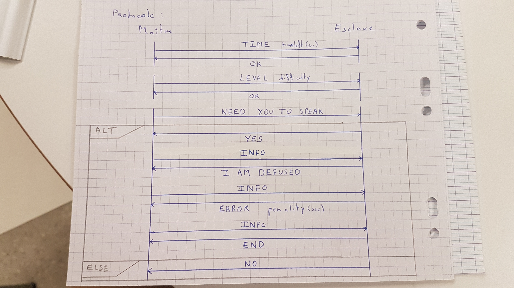

# KTNE-IRL

Keep Talking and Nobody Explodes, the IRL version.

## Getting started

This project is about creating a real version of the bomb defusal game Keep Talking and Nobody Explodes. By getting a copy of the project, you will be provided hardware schematics, software sources, documentation about inner project protocols and deployment informations.

The game is modular. Slaves, organised as modules, treat with a master module accordingly to a specific protocol.

### Prerequisites

We are using Atmega328* micro controllers as you can found on most Arduino boards. You can use their IDE. You will also need the following libraries :

- [Wire](https://www.arduino.cc/en/Reference/Wire) library to deal with I2C communications.
- [ktne core library](/libraries/ktne_core/) : slaves are built upon it. You should install it and link it to your slave(s).
- [ktne shared library](/libraries/ktne_shared/) : shared tools between modules.

### Installing

In order to run a minimal setup, you'll need to build and run at least one master module and one slave module.
You will find those two under [templates](templates/).

## Protocol

Master and slaves are communicating using the following protocol which consists of sending a command and a parameter, each rely on two uint16_t.
Slaves can only respond to the master's questions. Thus, a command number refers to a question and an answer.

This table describes the questions asked by the master :

| Command | Parameter    | Meaning                                 |
| :-----: | :----------: | :-------------------------------------: |
| 0       | timeleft (s) | Update timeleft                         |
| 1       | level [1;3]  | Update difficulty                       |
| 2       |              | Do you need to send some informations ? |
| 3       |              | Request the next information            |

This table describes the answers of the slaves :

| Command | Byte 1       | Byte 2       | Answer                        |
| :-----: | :----------: | :----------: | :---------------------------: |
| 0       | 1            | 0            | Ok                            |
| 1       | 1            | 0            | Ok                            |
| 2       | 1            | 0            | Yes                           |
| 2       | 0            | 0            | No                            |
| 3       | 4            | 0            | User defused the modules      |
| 3       | 5            | penality (s) | User made mistake             |

## Running the tests

You can debug modules using serial communication.

## Built With

* [Wire](https://www.arduino.cc/en/Reference/Wire) - I2C / TWI devices communication library
* [Ktne_core](https://github.com/valkheim/KTNE-IRL/tree/master/ktne_core) - KTNE module core library

## Contributing

Please read [CONTRIBUTING.md](CONTRIBUTING.md) for details on our code of conduct, and the process for submitting pull requests to us.

## Authors

* **Charles Paulet** - *Initial work* - [Github](https://github.com/valkheim)
* **Théophile Champion** - *Helper* - [Github](https://github.com/ChampiB)
* **Nicolas-Emmanuel Robert** - *Dev* - [Github](https://github.com/6e656d6d61)

See also the list of [contributors](https://github.com/valkheim/KTNE-IRL/contributors) who participated in this project.

## License

Copyright (C) 2017-2018 Charles Paulet

This program is free software: you can redistribute it and/or modify it under the terms of the GNU General Public License as published by the Free Software Foundation, version 3.

This program is distributed in the hope that it will be useful, but WITHOUT ANY WARRANTY; without even the implied warranty of MERCHANTABILITY or FITNESS FOR A PARTICULAR PURPOSE. See the GNU General Public License for more details.
