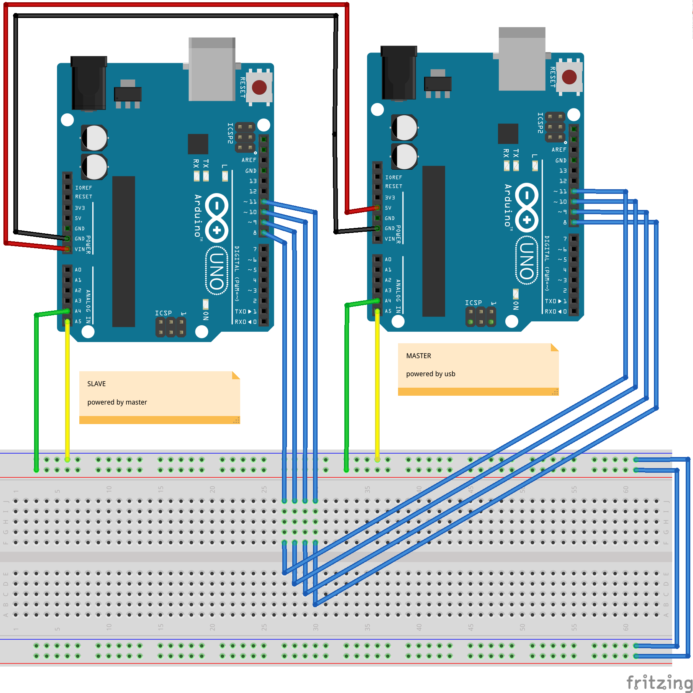

# Understanding the examples

As you want to setup the project yourself, you'll better read the following guide. The project consists in one master / n slaves communicating through an I2C bus accordingly to a defined protocol.

## Addressing

Each module needs an address to communicate on the bus. In the master, 4 pins are set to HIGH to provide a way of addressing (see `int as[] = {8, 9, 10, 11};`). The slave can use 0 to 4 pins to binary encode its address (see `getI2CAddr()`)). Let's use a diagram :

```
      +--------------+
      |    MASTER    |
      +--------------+
          |  |  |  |
          |  |  |  |
           \  \  \  \
             \  \  \  \
              |  |  |  |
              |1 |1 |1 |1
         +------------------+
         |      SLAVE       |
         +------------------+
```

Slave address it then 1111(2) or 15(10) or 0x0F(16)

```
      +--------------+
      |    MASTER    |
      +--------------+
          |  |  |  |
          |  |  |  |
           \  \  \  \
             \  \  \  \_____
              |  |  |
              |1 |1 |1 |0
         +------------------+
         |      SLAVE       |
         +------------------+
```

Here, slave address is 1110(2) or 14(10) or 0x0E(16)

## Modules discovery

At serial monitorin start-up, master is scanning (see `scan()`) the 127 I2C available addresses and register them in an `bool addresses[127]` array. So it can ping them later.

## Communication

Protocol consists in questions asked by the master and answers of the slave(s). Each communication contains a command type and a value holding on a single byte.

Master pings every known module using the `void transmit(int addr, byte command, byte value)` function :

```
void pingEveryone()
{
  static byte x = 0;
  for (uint8_t i = 0 ; i < 127 ; ++i)
  {
    if (addresses[i] == true)
    {
      transmit(i,x,x);
      x++;
    }
  }
}

void loop()
{
  pingEveryone();
  delay(500);
}
```

For each transmission, master holds until it receive an answer.
Slave(s) is(are) responding to those transmissions by using `Wire.onRequest(i2c_receive_request);` and `Wire.onReceive(i2c_receive_data);`

The function `i2c_receive_data` is called when the slave receive a transmission from the master. It is used to remember the command type on a global `byte command = 0;` variable. It also retrieves value that may be useful for some commands.

```
void i2c_receive_data(int count)
{
  byte input;
  byte rxCount = 0;

  while (Wire.available() && rxCount < count) {
    input = (byte)Wire.read();
    if (rxCount == 0) {
      command = input;
    }
    else {
      value = input;
    }      
    rxCount++;
  }
}
```

The function `i2c_receive_request` is called when the master needs an answer from its slave (see master's `transmit` function). This handle the slave answer :

```
void i2c_receive_request()
{
  switch(command)
  {
    case 1:
      Wire.write(1);
      break;
    case 2:
      Wire.write(2);
      break;
    default:
      break;
  }
}
```

## Wiring

Here is a wiring example :
* Master is an arduino board rev v3 powered via usb cable
* Slave is an arduino board rev v3 powered by master via Vin pin
* Master set up four pins (8, 9, 10, 11) to permit addressing
* Slave use its 4 pins to get an address (an thus gets address 1111(2) or 15(10) or 0x0F(16))
* I2C bus is connected through SDA (Serial Data Line) and SCL (Serial Clock Line) dedicated pins (written A4 and A5 on PCB)




## Question(s) ?

Please feel free to open an [issue](https://github.com/valkheim/KTNE-IRL/issues).
